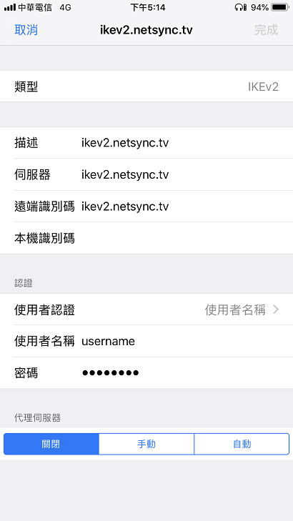

# 為移動而生的 VPN => iKEv2

基於 UDP、快、容錯率高，iKEv2 似乎就是為移動而生。雖是走 UDP 但實際使用挺穩定，所以不得不推薦。VPN 另外還有個對我比較有幫助的亮點為，臨時在外可透過 VPN 去操作區域內的其他電腦主機。

這邊整裡下收斂後的安裝過程，並附上一鍵安裝腳本，但由於 strongswan + ipsec 相對不好設定，會建議還是一步步照著 script 操作，遇到問題時盡量去看 `sudo cat /var/log/syslog` 然後再去搜狗。

**目標：在 Ubuntu-20.04.1 搭建 Strongswan iKEv2 Server，並在 iOS 14 / Win10 1909 透過 iKEv2 VPN 客戶端來連線。**

## Strongswan + iKEv2 + EAP 一鍵安裝腳本

請參考 strongswan_cert_install.sh 的一鍵安裝腳本，並修改下列變數。CERT_PASSWORD=為 CERT 的密碼，SERVER_DNS 為 StrongSwan 的域名或固定 IP，IPSEC_EAP_USERNAME 為 iKEv2 的 EAP 帳號，IPSEC_EAP_PASSWORD為 iKEv2 的 EAP 密碼。

```bash
CERT_PASSWORD=12345678
ROOTCA_PREFIX=ikev2_rootca
ROOT_DNS=netsync.tv
SERVER_PREFIX=ikev2_serverca
SERVER_DNS=ikev2.netsync.tv
SERVER_DNS6=ikev2_6.netsync.tv
IP_DNS1=192.168.1.22
IP_DNS2=127.0.0.1

CLIENT_PREFIX=ikev2_clientca
CLIENT_CN="deepkh@ikev2.netsync.tv"

IPSEC_EAP_USERNAME=username
IPSEC_EAP_PASSWORD=password
```

透過 `./strongswan_cert_install.sh install` 會依續執行下列片段。

1. StrongSwan 與其相依軟件
1. 產生 RootCA X509 憑證
1. 產生 StrongSwan Server X509 憑證
1. 設定 /etc/ipsec.conf
1. 設定 /etc/ipsec.secrets
1. 設定 /etc/strongswan.conf
1. 設定 /etc/network/if-up.d/iptables
1. loading EAP_MSCHAPV2 method failed

#### StrongSwan 與其相依軟件

安裝 StrongSwan 的必要軟件，這邊是在 Ubuntu-20.04.1 上實踐。

```bash
strongswan_packages_install() {
	sudo apt-get install strongswan strongswan-swanctl libcharon-extra-plugins strongswan-pki iptables-persistent libstrongswan-extra-plugins libstrongswan-standard-plugins libcharon-extra-plugins resolvconf --no-install-recommends
}
```


    
#### RootCA X509 憑證

其中 /O=組織名，/CN=識別字串。

```bash
CERT_PASSWORD=12345678
ROOTCA_PREFIX=ikev2_rootca

# Generate RootCA's X509 Certificate
rootca_gen() {
	openssl genrsa -aes256 -out $ROOTCA_PREFIX.key -passout pass:$CERT_PASSWORD 2048
	openssl req -new -sha256 -key $ROOTCA_PREFIX.key -subj "/O=Netsync.tv/CN=iKEv2 VPN Personal Root Certificate" -config <(cat /etc/ssl/openssl.cnf ) -out $ROOTCA_PREFIX.csr -extensions v3_ca -passin pass:$CERT_PASSWORD
	openssl x509 -req -in $ROOTCA_PREFIX.csr -out $ROOTCA_PREFIX.crt -days 10950 -signkey $ROOTCA_PREFIX.key -extfile /etc/ssl/openssl.cnf -extensions v3_ca -passin pass:$CERT_PASSWORD
}
```

#### iKEv2 VPN Server X509 憑證

其中 /O=組織名，/CN=$SERVER_DNS=域名或一個固定IP。這邊有使用 subjectAltName，所以可以新增數個域名或IP。

```bash
SERVER_DNS=ikev2.netsync.tv
SERVER_DNS6=ikev2_6.netsync.tv
IP_DNS1=192.168.1.22
IP_DNS2=127.0.0.1

# Generate StrongSwan Server's X509 Certificate
serverca_gen() {
	openssl genrsa -out $SERVER_PREFIX.key 2048
	openssl req -new -sha256 -key $SERVER_PREFIX.key -subj "/O=Netsync.tv/CN=$SERVER_DNS" -config <(cat openssl.cnf ) -out $SERVER_PREFIX.csr -extensions server_cert2 
	openssl x509 -req -in $SERVER_PREFIX.csr -CA $ROOTCA_PREFIX.crt -CAkey $ROOTCA_PREFIX.key -CAcreateserial -out $SERVER_PREFIX.crt -days 3650 -extfile <(cat openssl.cnf <(printf "subjectAltName=DNS:$SERVER_DNS,DNS:$SERVER_DNS6,IP:$IP_DNS1,IP:$IP_DNS2")) -extensions server_cert2 -passin pass:$CERT_PASSWORD
}

```

#### 設定 /etc/ipsec.conf

目前可透過 EAP 帳號密碼連線。尚未無法透過憑證連線，不確定原因為何。

```bash
# Setting /etc/ipsec.conf
ipsec_conf() {
	sudo bash -c "cat > /etc/ipsec.conf2 << EOF2
config setup
    charondebug=\"ike 2, knl 3, cfg 0\"
    uniqueids=no

conn ikev2-vpn
    auto=add
    compress=no
    type=tunnel
    keyexchange=ikev2
    fragmentation=yes
    forceencaps=yes
    #ike=aes256-sha1-modp1024,3des-sha1-modp1024!
    #esp=aes256-sha1,3des-sha1!
    ike=aes256-sha1-modp1024,aes128-sha1-modp1024,3des-sha1-modp1024! # Win7 is aes256, sha-1, modp1024; iOS is aes256, sha-256, modp1024; OS X is 3DES, sha-1, modp1024
    esp=aes256-sha256,aes256-sha1,3des-sha1!                          # Win 7 is aes256-sha1, iOS is aes256-sha256, OS X is 3des-shal1
    dpdaction=clear
    dpddelay=300s
    rekey=no
    #Server
    left=%any
    leftid=@$SERVER_DNS
    leftcert=$SERVER_PREFIX.crt
    leftsendcert=always
    leftsubnet=0.0.0.0/0
    #Client
    right=%any
    rightid=%any
    rightdns=8.8.8.8,8.8.4.4
    rightsourceip=10.10.10.0/24
    #rightcert=VPNCA3.crt       can't working, instead of following 3 items
    rightauth=eap-mschapv2
    rightsendcert=never
    eap_identity=%identity
EOF2"
}

```

#### 設定 /etc/ipsec.secrets

$IPSEC_EAP_USERNAME 與 $IPSEC_EAP_PASSWORD 為客戶端驗證的帳號與密碼。

```bash
IPSEC_EAP_USERNAME=username
IPSEC_EAP_PASSWORD=password

# Setting /etc/ipsec.secrets
ipsec_secrets() {
	sudo bash -c "cat > /etc/ipsec.secrets2 << EOF1
$SERVER_DNS : RSA \"$SERVER_PREFIX.key\"
$IPSEC_EAP_USERNAME : EAP \"$IPSEC_EAP_PASSWORD\"
#include /var/lib/strongswan/ipsec.secrets.inc
EOF1"
}
```

#### 設定 設定 /etc/strongswan.conf

StrongServer 給與客戶端的私有 IP，範例為 10.10.10.0/24 (由 rightsourceip 決定)，其 DNS 為 8.8.8.8。 Ubuntu-20.04.1 需要額外 "load = eap-mschapv2" 不然冒似 ipsec 起來後 eap-mschapv2 plugin 不會自動被載入。

```bash
strongswan_conf() {
	sudo bash -c "cat > /etc/strongswan.conf2 << EOF3
charon {
    #duplicheck.enable = no
    load = eap-mschapv2 
    install_virtual_ip = yes
    dns1 = 8.8.8.8
    dns2 = 8.8.4.4
    load_modular = yes
    plugins {
        include strongswan.d/charon/*.conf
    }
}

include strongswan.d/*.conf
EOF3"
}

```


#### 設定 /etc/network/if-up.d/iptables

10.10.10.0 為 iKEv2 StrongSwan Server 配給客戶端的網內 IP，主要讓 10.10.10.0 能透過 NAT 出去公開的網路。ppp0 為 StrongSwan 的公開 IP 接口。

```bash
...
#### ipsec: allow server
ALL_ACCEPT_IPSECS_UDP_PORTS="500 4500"
for PORT in $ALL_ACCEPT_IPSECS_UDP_PORTS
do
    $iptables -A INPUT -p udp --dport $PORT -j ACCEPT
done


#### ipsec: allow forward
#### Also need to add routing table at LAN 192.168.4.0 as following
#### route ADD 10.10.10.0 MASK 255.255.255.0 192.168.4.2
$iptables -A FORWARD --match policy --pol ipsec --dir in  --proto esp -s 10.10.10.0/24 -j ACCEPT
$iptables -A FORWARD --match policy --pol ipsec --dir out --proto esp -d 10.10.10.0/24 -j ACCEPT

#### ipsec: masquerade to internet
$iptables -t nat -A POSTROUTING -s 10.10.10.0/24 -o ppp0 -j MASQUERADE
...
```


#### loading EAP_MSCHAPV2 method failed


如果在客戶端連接時 `sudo cat /var/log/syslog | grep loading EAP_MSCHAPV2` 出現了

```bash
ipsec[5124]: 11[IKE] loading EAP_MSCHAPV2 method failed
```

那麼請記得安裝

```bash
sudo apt-get install libstrongswan-extra-plugins libstrongswan-standard-plugins libcharon-extra-plugins 
```

那麼確認 eap-mschapv2 已被 ipsec 載入 `ipsec statusall | grep eap-mschapv2`

```bash
  loaded plugins: ... eap-mschapv2 ...
```


## iOS 14 iKEv2 客戶端設定

iKEv2 客戶端驗証過 iOS 14

1. 安裝 RootCA X509 憑證
1. 設定 iKEv2 客戶端

#### RootCA X509 憑證

發送由上一章節產生的 ikev2_rootca.crt 給 iOS 手機端，這邊使用"郵件"，並點擊附檔 ikev2_rootca.crt 安裝完成如下圖。


#### 設定 iKEv2 客戶端

帳號為 username 密碼為 password，設定如下圖。




## Windows 10 iKEv2 客戶端設定

Win10 原生已支援 iKEv2，僅需按下列步驟進行。

#### 增加 ikev2_rootca.crt 憑證

1. 雙擊 `ikev2_rootca.crt`
1. 點擊安裝憑證
1. 選擇安裝位置為 `本機電腦`
1. 憑證存放區為 `受信任的根憑證授權單位`
1. 跳出新增成功


#### 設定 iKEv2 連線

1. 進入 `設定` 後並點擊 `VPN`
1. 點擊 `新增 VPN 連線`
1. 設定 iKEv2 客戶端


    1. 連線名稱：任意
    1. 伺服器名稱或位址：`ikev2.netsync.tv`
    1. VPN 類型：`iKEv2`
    1. 登入資訊的類型：`使用者名稱與密碼`
    1. 使用者名稱：`username`
    1. 密碼：`password`
1. 點擊`連線`

若無法連線，檢查 `控制台` 裡的 `網路連線` 的 `ikev2.netsync.tv` 的選項，選擇它按右鍵裡的 `內容`，在`安全性`裡選擇`Microsoft: Secured password(EAP-MSCHAP-V2)`。


1. 設定 VPN 連線為預設路由，`使用遠端網路的預設閘道`必須勾選，不然依然會走預設閘道出去(重要!!)


#### 增加 10.10.10.0 到路由表

若要 iKEv2 Client 存取內部部網路的其他主機，在內部網路的每台被存取主機新增下列路由。ex: 想讓 192.168.1.2 被遠端 iKEv2 Client 存取。 "-p" 為永續。

```
route -p ADD 10.10.10.0 MASK 255.255.255.0 192.168.1.2
```

## 參考網頁

* [iOS (Apple iPhone, iPad...) and macOS](https://wiki.strongswan.org/projects/strongswan/wiki/AppleClients)
* [IPSEC VPN搭建](https://jmpews.github.io/2016/12/10/notes/IPSecVPN%E6%90%AD%E5%BB%BA)
